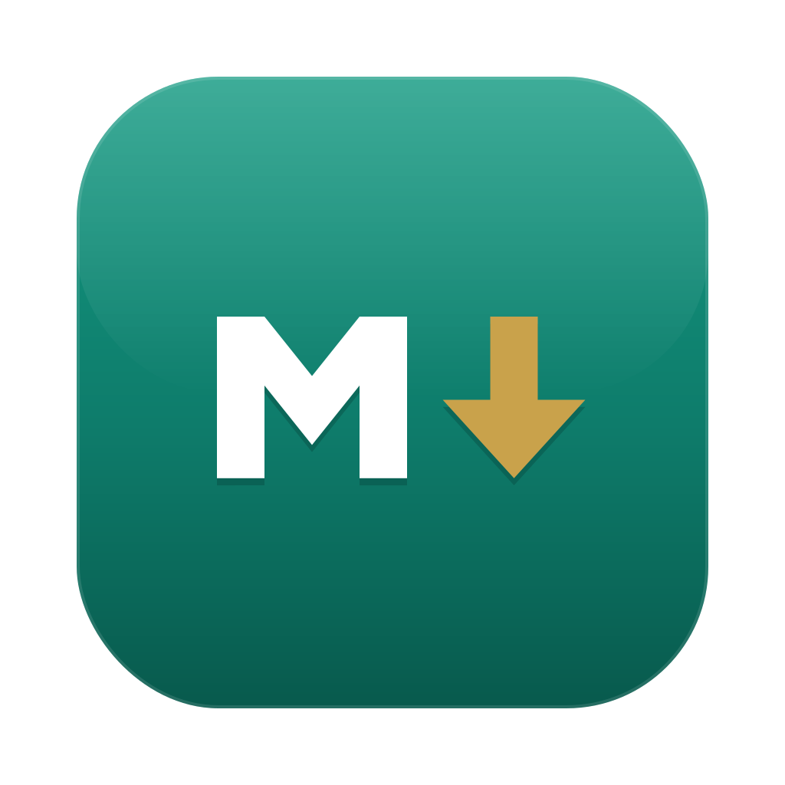

<p align="center"></p>

# markmore

**Markdown, beautifully rendered — straight from your terminal.**

`markmore README.md` opens a native macOS window with your markdown the way it's meant to look — GitHub styling, syntax-highlighted code, mermaid diagrams, live reload.

```sh
markmore                  # right here — opens ./README.md, or a folder index
markmore README.md        # native window, GitHub rendering, live reload
markmore docs/            # browse a folder
git log | markmore        # preview stdin
```

The window detaches — your prompt comes right back, no `&` needed.

## Features

- **Live reload** — re-renders on save (handles editors' atomic saves), keeps your scroll position
- **Real GitHub rendering** — [github-markdown-css](https://github.com/sindresorhus/github-markdown-css) + [highlight.js](https://highlightjs.org) GitHub themes; follows system light/dark with a View-menu override
- **Mermaid** — ```` ```mermaid ```` fences render as diagrams, theme-aware
- **Browse a repo's docs** — relative `.md` and folder links open in-window; `Cmd+[` back, `Cmd+]` forward
- **History tabs** — visit a second doc and a slim tab strip appears with your trail; click to jump, × to forget. One doc open = no tabs, no chrome. We are not Obsidian.
- **File tree** — `Cmd+B` toggles a slim rail of *all* the folder's files. Off by default. Still not Obsidian.
- **Opens anything** — source files render syntax-highlighted, images render as images, and binaries get a classic `hexdump -C` view. `Cmd+Shift+H` forces hex on any file, for the old unix souls checking bytes. Try it on [samples/magic.bin](samples/magic.bin).
- **Relative images** resolve against the file's directory; external links open in your browser
- Everything vendored into a single self-contained binary — works offline, no runtime dependencies

`Cmd+W` close · `Cmd+Q` quit · `Cmd+R` reload

## Install

```sh
brew install jasonmimick/markmore/markmore
```

Builds from source on your Mac with `swiftc` (ships with Xcode Command Line Tools) — no Gatekeeper warnings, nothing unsigned downloaded.

Or from a clone:

```sh
./build.sh   # installs markmore.app to ~/Applications + wrapper to ~/.local/bin
```

## Using an AI coding agent?

markmore ships as a skill for the major agent CLIs — your agent learns to offer rendered previews of the markdown it writes:

- **Claude Code**: `/plugin marketplace add jasonmimick/markmore` then `/plugin install markmore@markmore`
- **Codex CLI** (and other `.agents/skills` agents): the skill is bundled in this repo at `.agents/skills/markmore/`
- **Kiro**: add this repo as a Power (`POWER.md` included)

## Why

Every markdown previewer is either $14, an Electron app, a terminal approximation, or trapped inside an editor. This one is a command: type it, see the document, hit `Cmd+W`, back to work.

## Credits

- [marked](https://github.com/markedjs/marked), [github-markdown-css](https://github.com/sindresorhus/github-markdown-css), [highlight.js](https://github.com/highlightjs/highlight.js), [mermaid](https://github.com/mermaid-js/mermaid) — vendored at build time
- Icon based on the [Markdown Mark](https://github.com/dcurtis/markdown-mark) (CC0) by Dustin Curtis

MIT © Jason Mimick
