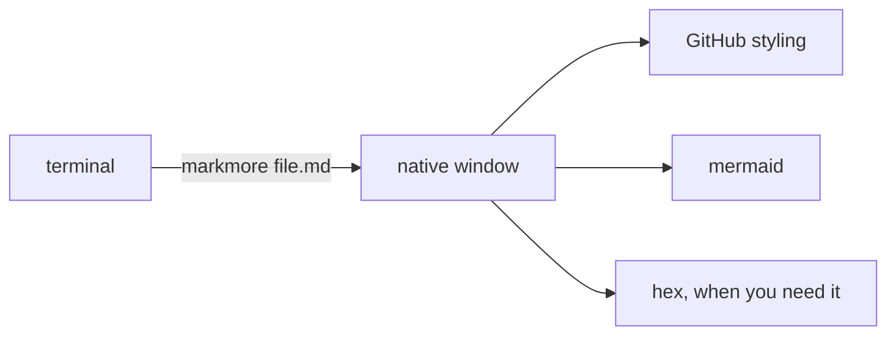

# the tour

**bold**, *italic*, `code`, [a link](https://github.com/jasonmimick/markmore), and a task list:

- [x] native window
- [x] live reload
- [ ] your feature here

| feature | keys |
|---|---|
| file tree | ⌘B |
| hex dump | ⌘⇧H |
| zoom | ⌘+ / ⌘- |
| typography | View ▸ Typography |



```python
def preview(path):
    return "rendered, not dumped"
```
